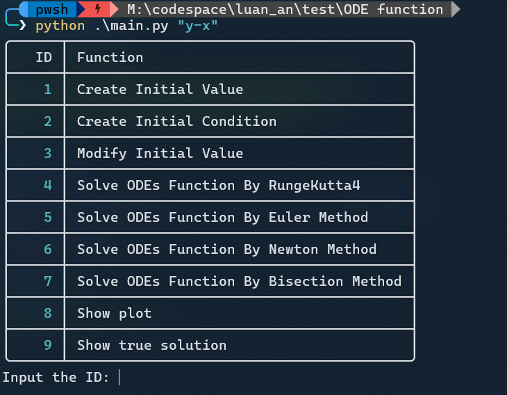
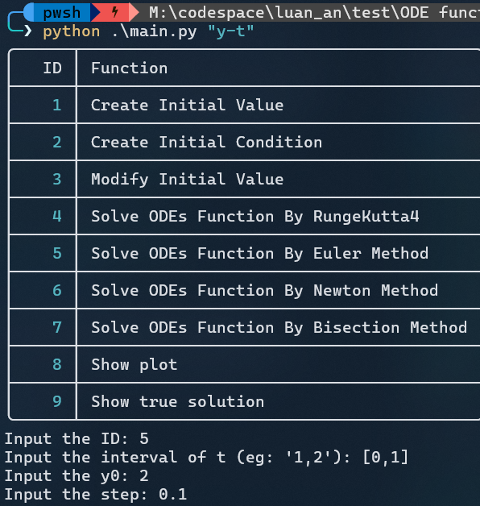
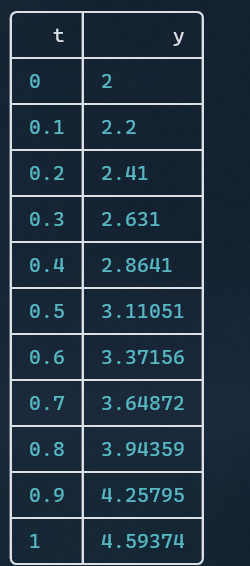
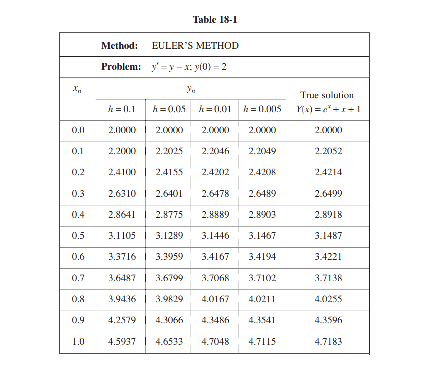

# A Calculator Solve ODEs Function

Solve ODE Function by different method (Euler Method, Runge Kutta 4th order, Bisection method)

## Installation

#You can go to the Code and download the zip file

#If you using git, you can download this via Git. From your terminal:

```bash
$ mkdir ode_function

$ cd ode_function

$ git clone https://github.com/nguyn21012003/numerical-method-for-ODEs-function.git
```

## Tutorial

Ex1: Find y(1) for y' = y - x; y(0) = 2, using Euler's meethod with h = 0.1

In your terminal:

Now you need to change x->t

```bash
$ python main.py "y-t"
```

The ODEs Function must be in the quotes



Type

```bash
$ 5
```

You will need 3 values:

- y0

- Interval of t

- h step

y0 will be y(0) = 2

h is 0.25. The more this value is small, the more accuracy solution of this function.

and finally is the interval of t. It will be up to you, I will set it is from 0 to 1 for instances. Now you need follow the rule. Your input must be [a,b] for eg: [0,1].



The result will be:



Compare this to the solution



[References: Schaum's Outlines: Differential Equations, 4th Edition](https://)

## Contributing

Pull requests are welcome. For major changes, please open an issue first
to discuss what you would like to change.

Please make sure to update tests as appropriate.

## License

MIT License
